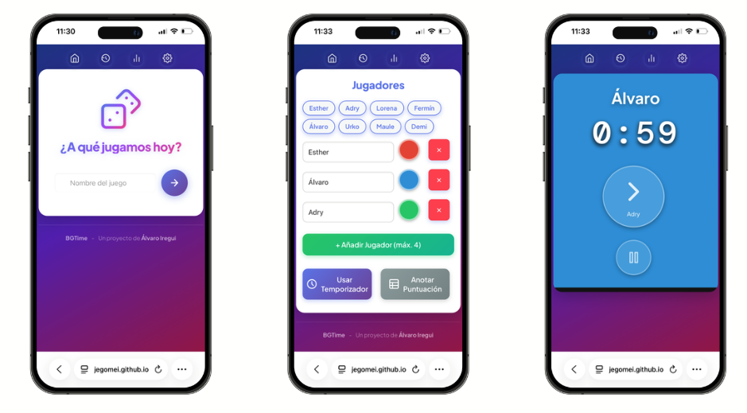
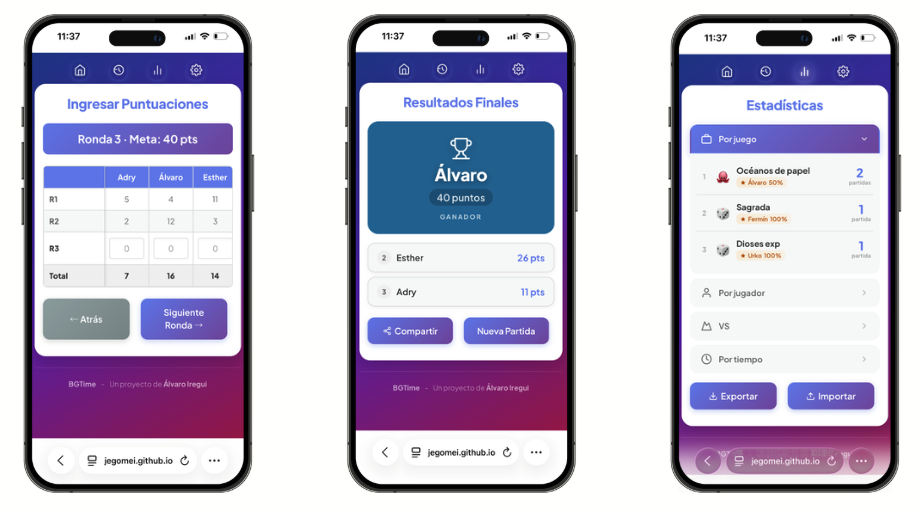

# 🎲 BGTime — Temporizador y contador para juegos de mesa

**BGTime** es una app web pensada para jugar mejor en mesa. Sin instalación, sin registro, sin complicaciones — ábrela en el móvil y ya está lista para tu partida.
También puedes iniciar sesión con tu cuenta de Google, añadir amigos, y las partidas que juguéis juntos se sincronizarán. Un jugador apunta el resultado, y les aparece a todos en su app!

🔗 **[Abrir la app](https://jegomei.github.io/BGTime/)**

---

## 📸 Capturas

---

## ¿Qué hace?

BGTime combina dos herramientas en una: un **temporizador por turnos** y un **contador de puntuación**, todo en la misma sesión de juego.

### ⏱️ Temporizador por turnos
- Asigna tiempo por jugador y pasa el turno con un solo toque
- Cada jugador tiene su propio color
- Puedes pausar la partida en cualquier momento
- Opción de reordenar el turno cada ronda
- Modo reloj de ajedrez: tiempo total para la partida, que cada jugador se lo distribuya

### 🧮 Contador de puntuación
- Varios modos: puntuación simple, por rondas, por ítems, por rondas con ítems, o hasta alcanzar un objetivo
- Compatible con puntuaciones negativas
- Calcula los totales automáticamente
- Se puede usar junto al temporizador o por separado

### 🏆 Resultados y desempates
- Pantalla de resultados con ganador destacado
- Si hay empate, la app pregunta al usuario cómo desempatar — sin decidir por su cuenta
- Comparte los resultados por WhatsApp, Telegram o donde quieras con un toque

### 📊 Estadísticas e historial
- Guarda automáticamente cada partida jugada
- Consulta quién gana más, en qué juegos, y el historial completo
- Comparativa directa entre dos jugadores (cara a cara)
- Estadísticas de tiempo: quién tarda más en cada turno
- Reconoce a los jugadores aunque su nombre se haya escrito con o sin tilde

### 🎮 Biblioteca de juegos
- Incluye una biblioteca con juegos predefinidos para configurar la partida rápidamente
- También puedes crear y guardar tus propias configuraciones

### 🌙 Otros detalles
- Modo oscuro
- Diseño adaptado a móvil (funciona genial en iPhone y Android)
- No necesita conexión a internet después de cargar
- Sin anuncios, sin nada que estorbe

---

## ¿Cómo se usa?

1. Abre la app en el navegador de tu móvil: **[jegomei.github.io/BGTime](https://jegomei.github.io/BGTime/)**
2. Añádela a la pantalla de inicio para tenerla siempre a mano (en iOS: botón compartir → *Añadir a pantalla de inicio*)
3. Escribe el nombre del juego, añade los jugadores y elige el modo de puntuación
4. ¡A jugar!

---

*Hecho con ganas de jugar más y contar menos.*
